# Formula-Uno

## 📌 Sobre o projeto

O jogo foi desenvolvido em junho de 2024 como um projeto para a disciplina Laboratório de Programação (Profº Francesco Artur Perrotti) do curso de Jogos Digitais do Centro Paula Souza - Faculdade Ministro Ralph Biasi (FATEC AMERICANA).

## 🚗 Sobre o Jogo FormulaUNO

O projeto "Fórmula Uno" é um jogo de corrida desenvolvido utilizando uma plataforma Arduino Uno. No jogo, o jogador deve desviar de obstáculos para ganhar pontos, com o uso de botões pushbutton para controlar o carro. Um display LCD 16x2 é utilizado para mostrar a pontuação, enquanto um LED RGB serve como semáforo de largada, mudando de vermelho para amarelo e depois para verde. Um buzzer fornece feedback sonoro durante as mudanças de luz e sinaliza o início da corrida com um som mais longo. O projeto foi prototipado no Tinkercad e implementado com componentes reais, utilizando a biblioteca LiquidCrystal I2C para a interface do display.

## 📟 Sobre o Arduino Uno

O Arduino Uno é uma plataforma de prototipagem eletrônica de código aberto baseada em hardware e software flexíveis e fáceis de usar. É amplamente utilizado em projetos de eletrônica, robótica e sistemas embarcados. É a placa principal do projeto, responsável pelo controle de todos os dispositivos conectados.

## 📚 Prototipação

No desenvolvimento deste projeto, utilizamos o Tinkercad para criar um
protótipo virtual do circuito, permitindo testar e validar o funcionamento antes de
passar para a montagem física. A seguir, detalhamos como cada componente
foi integrado no Tinkercad:

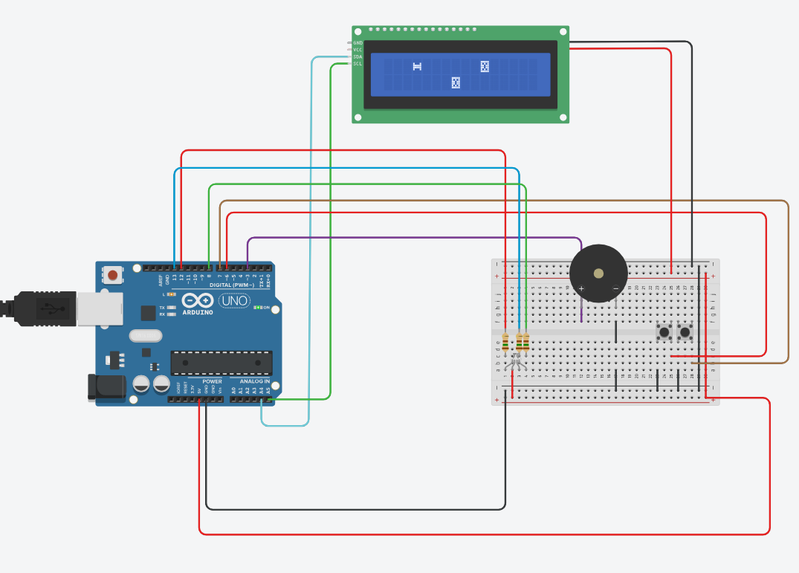

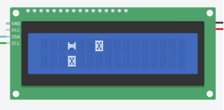

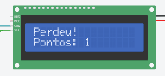

## 🕹️ Demonstração do Projeto

Durante a concepção do projeto, exploramos diversos componentes
eletrônicos essenciais para a interação e feedback do jogador. O Arduino Uno,
como peça central, demonstrou sua versatilidade ao controlar o LED RGB,
botões pushbutton, display LCD 16x2 e transdutor piezoelétrico. Cada
componente desempenhou um papel crucial: o LED RGB simulou um semáforo
de largada realista, enquanto os botões permitiram ao jogador controlar o carro
virtual, desviando dos obstáculos exibidos no display LCD. O feedback sonoro
proporcionado pelo transdutor piezoelétrico complementou a experiência
imersiva do jogo, fornecendo sinais auditivos que acompanhavam cada ação do
jogador. 

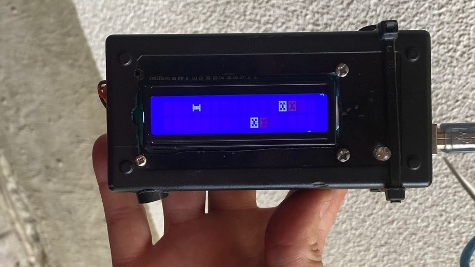

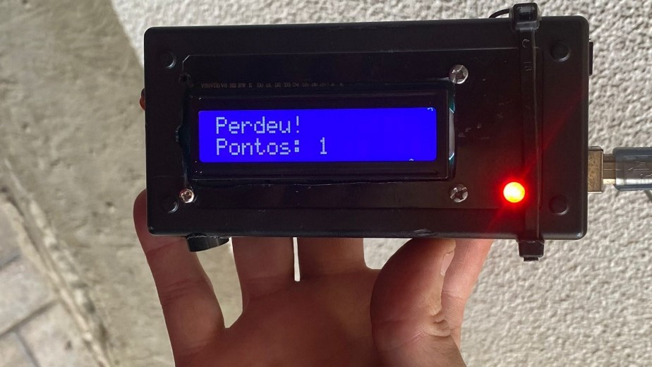

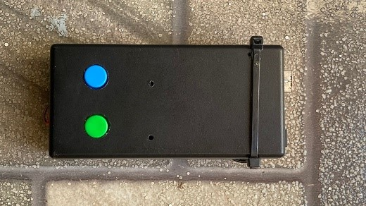

## 🛠️ Componentes de Hardware Utilizados

**Arduino Uno** -> O Arduino Uno é uma placa de prototipagem eletrônica baseada no microcontrolador ATmega328P. Ele possui 14 pinos digitais de entrada/saída, 6 pinos analógicos, um cristal oscilador de 16 MHz, uma conexão USB, uma entrada de alimentação, um botão de reset e mais. O Arduino Uno é a placa principal do projeto, responsável por controlar todos os dispositivos conectados.

**Módulo I12C** -> O Módulo I2C é usado para expandir a capacidade do Arduino ao permitir
a comunicação com múltiplos dispositivos utilizando apenas dois pinos,
simplificando as conexões de hardware. 

**Protoboard** -> A Protoboard é utilizada para a montagem do circuito de forma prática e
organizada. Permite conexões temporárias e facilita ajustes durante o
desenvolvimento do projeto. 

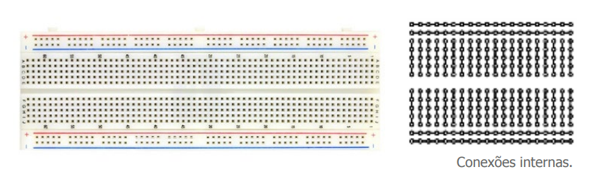

**DISPLAY LCD 16X2** -> O Display LCD 16x2 é utilizado para exibir a pontuação do jogador e
mensagens importantes durante o jogo. Com capacidade de mostrar 16
caracteres em 2 linhas, é ideal para fornecer feedback visual claro. 

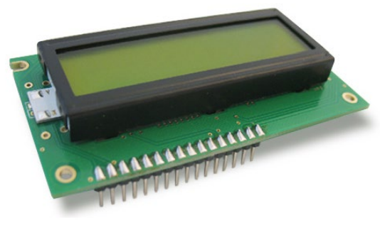

**LED RGB** -> O LED RGB utilizado é de anodo comum, o que significa que o terminal
positivo é compartilhado entre as três cores (vermelho, verde e azul). Isso implica
que cada cor é controlada através do aterramento de seus cátodos individuais.
A vantagem de um LED de anodo comum é que ele pode ser facilmente
controlado usando uma lógica de baixa tensão para ligar e desligar cada cor. 

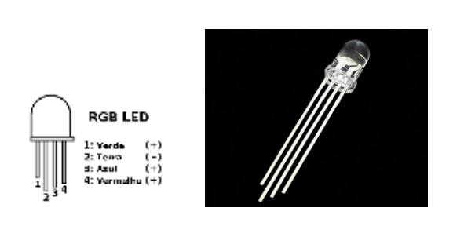

**BOTÕES PUSHBUTTON** -> Os botões PushButton são dispositivos de entrada usados para fornecer
uma interface de controle em diversos projetos eletrônicos, permitindo ao usuário
enviar comandos ao sistema, como desviar dos obstáculos no jogo. Dois botões
são usados para aumentar a interatividade e o controle do jogador. 

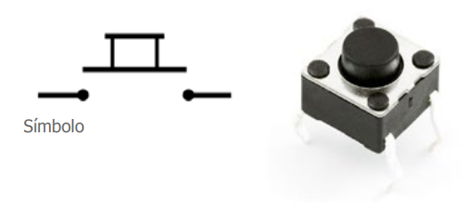

**TRANSDUTOR PIEZOELÉTRICO** -> Um transdutor piezoelétrico é utilizado para detectar vibrações ou golpes.
Este transdutor eletroacústico pode também ser utilizado como Buzzer para
emitir sons, no projeto foi utilizado para fornecer feedback auditivo ao jogador.

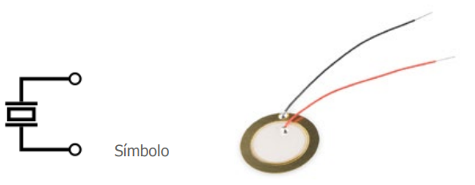

## 💾 Componentes de Software Utilizados

A biblioteca Wire.h faz parte da biblioteca padrão do Arduino e é usada
para facilitar a comunicação I2C (Inter-Integrated Circuit) entre o Arduino e
dispositivos periféricos. No código, a biblioteca Wire.h é usada em conjunto com a
LiquidCrystal_I2C.h para controlar um display LCD via comunicação I2C. 

Para facilitar a interface com o display LCD, utilizamos a biblioteca
LiquidCrystal I2C, A biblioteca LiquidCrystal_I2C.h é uma biblioteca específica
para controlar displays LCD usando a comunicação I2C, baseada na biblioteca
padrão LiquidCrystal do Arduino.

Em resumo a biblioteca LiquidCrystal_I2C.h é usada para
inicializar e controlar o display LCD, exibindo o carro (jogador), os obstáculos e
as mensagens de status. Em resumo Wire.h é para a comunicação I2C,
enquanto a biblioteca LiquidCrystal_I2C.h faz o controle do display LCD através
dessa comunicação. 

## 📚 Referências

- [ARDUINO](https://docs.arduino.cc/language-reference/pt/)
- [LIB](https://github.com/johnrickman/LiquidCrystal_I2C)
- [Componentes](https://www.filipeflop.com/)
- [TINKERCAD](https://www.tinkercad.com/)
- [Multilogica-shop](https://www.multilogica-shop.com/)
- [FATEC AMERICANA](https://www.fatec.edu.br/)

## 👩‍💻 Autores

- *Andre Guilherme Correa* | [correandre8@gmail.com](mailto:correandre8@gmail.com)
- *Leonardo de Oliveira Soares* | [leonardo.soares19@fatec.sp.gov.br](mailto:leonardo.soares19@fatec.sp.gov.br)
- *Matheus Crivelaro Calian* | [matheus.calian@fatec.sp.gov.br](mailto:matheus.calian@fatec.sp.gov.br)
- *Thiago Henrique Rodrigues Edmundo* | [thiago.edmundo@fatec.sp.gov.br](mailto:thiago.edmundo@fatec.sp.gov.br0)
